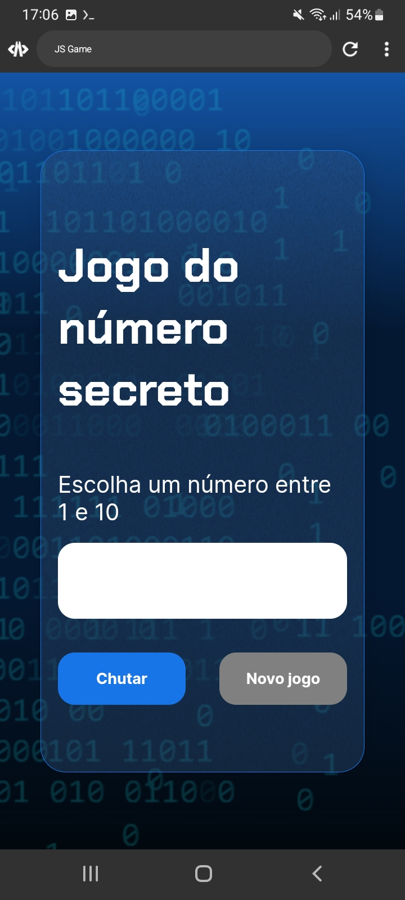

## Jogo do Número Secreto
Jogo simples de adivinhar o número secreto feito durante o curso de Lógica de Programação com JavaScript da formação [Iniciante em Programação](https://cursos.alura.com.br/formacao-logica-de-programacao-turma-6-oracle-one) da Alura

